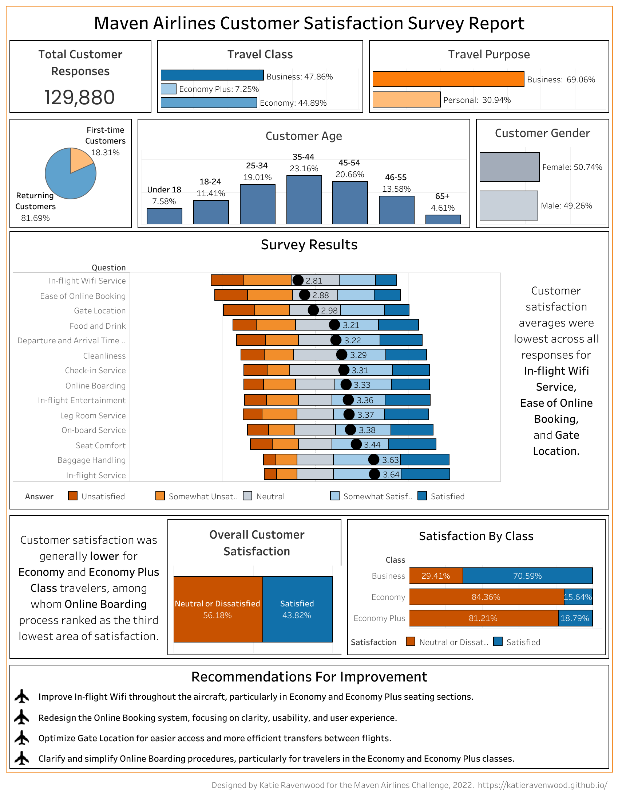

# Data Visualization Projects
Personal data visualization projects including challenge entries.

## Independent Projects

### Tableau Visualizations
Projects based on interesting datasets and visualization ideas created using Tableau public and various public and personally created datasets. 
(Tableau Public Profile: Katie Ravenwood)[https://public.tableau.com/app/profile/katie.ravenwood]

<table>
  <tr>
    <td colspan=2><b>(USA Weekly COVID-19 Community Levels by County)[https://public.tableau.com/app/profile/katie.ravenwood/viz/USAWeeklyCOVID-19CommunityLevelsbyCountyFeb22-Mar23/UnitedStatesCOVID-19LevelsbyCounty#2]</b></td>
  </tr>
  <tr>
    <td></td>
    <td>
      Heat map by county of community levels of COVID-19 as provided by the CDC from February 2022 to March 2023. 
      Source Data: CDC: (United States COVID-19 Community Levels By County)[https://data.cdc.gov/Public-Health-Surveillance/United-States-COVID-19-Community-Levels-by-County/3nnm-4jni] 
      <ul>
        <li>Single-sheet image: <a href="https://github.com/katieravenwood/DataVizProjects/blob/215c4a353660774bc22c0b50a03a4e422626f40a/TableauViz/USCOVID-19LevelsbyCounty.png" width=100>USA Weekly COVID-19 Community Levels by County</a></li>
        <li>Interactive Tableau Dashboard: <a href="https://public.tableau.com/views/USAWeeklyCOVID-19CommunityLevelsbyCountyFeb22-Mar23/UnitedStatesCOVID-19LevelsbyCounty?:language=en-US&:display_count=n&:origin=viz_share_link">USA Weekly COVID-19 Community Levels by County Tableau Dashboard</a></li></ul>
    </td>
  </tr>
   <tr>
    <td colspan=2><b>(US COVID Cases Over Time Racing Graph)[https://public.tableau.com/views/USCOVIDCasesOverTimeByStateMetroandTotalCasesvs_Deaths/USCOVIDCasesOverTime?:language=en-US&:display_count=n&:origin=viz_share_link]</b></td>
  </tr>
  <tr>
    <td></td>
    <td>
      I experimented with a racing graph format showing the weekly change in COVID-19 cases from January of 2020 to August of 2022 by state or major metropolitan area, as reflected in the CDC's dataset of United States COVID-19 Cases and Deaths by State over Time in a two-page dashboard also showing the comparison of postive test cases and deaths over the same time period.<ul>
        <li>Single-sheet image: <a href="https://github.com/katieravenwood/DataVizProjects/blob/ea2a3de3f0bdfbaf311b117271f00f1add64bc78/TableauViz/US%20COVID%20Cases%20Over%20Time.png" width=100>US COVID Cases Over Time Racing Graph</a></li>
        <li>Interactive Tableau Dashboard: <a href="https://public.tableau.com/views/USCOVIDCasesOverTimeByStateMetroandTotalCasesvs_Deaths/USCOVIDCasesOverTime?:language=en-US&:display_count=n&:origin=viz_share_link">US COVID Cases Over Time Racing Graph Interactive Dashboard</a></li></ul>
        <li>Original Data Source: a href="https://data.cdc.gov/d/9mfq-cb36">United States COVID-19 Cases and Deaths by State over Time</li>a></li>
    </td>
  </tr>
</table>

## Challenges:

### Maven Analytics Challenges
Visualizations related to various Maven Analytics Challenges, some submitted for competition, some completed for practice purposes after challenges have closed. Information on challenges and starter datasets can be found at https://www.mavenanalytics.io/data-playground

<table>
  <tr>
    <td colspan=2><b>Maven Airlines Challenge</b></td><tr>
  <tr>
    <td></td>
    <td>The Maven Airlines Challenge focuses on analyzing customer survey data for insights related to improving pre-flight and in-flight services. Data provided as a single table and includes customer satisfaction survey responses for 120K+ customers. <ul><li>Single-sheet image: <a href="Challenges/Maven/MavenAirlinesChallenge/KRMAAirlineCSDashboard.png" width=100>Maven Airlines Challenge Single Sheet</a></li><li>Interactive Tableau Dashboard: <a href="https://public.tableau.com/views/MavenAirlinesChallenge_16542779098730/CSDashboard_1?:language=en-US&:display_count=n&:origin=viz_share_link">Maven Airlines Challenge Tableau Dashboard</a></li></ul></td>
  </tr>
</table>
